# 第一讲：强化学习基本介绍
## 多领域交叉
强化学习是很多领域的交叉，包括：
- 计算机科学
	- 机器学习
- 神经科学
	- 奖励系统
- 心理学
	- 古典/操作性条件反射
- 经济学
	- 有限理性
- 数学
	- ==运筹学==（和我的领域相关）
- 工程学
	- 最优控制

## 机器学习的分支
- 有监督学习
- 无监督学习
- 强化学习

## 强化学习的特点
- 没有标准答案，即标签，只有`奖励`信号
- 反馈不是及时的，而是`延时`的
- `时间`很重要（时序的，而非独立同分布的）
- 智能体的`行动`会影响到接下来它接收的数据

## 强化学习的例子
- 直升机特技飞行演习
- 在西洋双陆棋中击败世界冠军
- 管理投资组合
- 控制发电站
- 让一个人形机器人走路
- 在Atari游戏中比人类玩家表现更好

这些都是一些`动作`，不像之前学过的深度学习，大部分是做分类、预测

## 强化学习中的核心概念

### 奖励
- 奖励$R_t$（t时间的奖励）是一个反馈的`标量`信号
- 它表明了在第t步的`行动`的优劣
- 智能体的作用就是最大化`累积`奖励
	- 眼光长远

>一个仍存在争议的定义（奖励假设）：
>所有的目标都可以被描述为是最大化累积期望奖励

### 奖励的例子
- 直升机特技飞行演习
	- 遵循预期飞行轨迹：奖励+
	- 坠毁：奖励-
- 在西洋双陆棋中击败世界冠军
	- 赢得/输掉比赛：奖励+/-
- 管理投资组合
	- 每单位入账使奖励+
- 控制发电站
	- 发电：奖励+
	- 超过安全阈值：奖励-
- 让一个人形机器人走路
	- 前进：奖励+
	- 跌倒：奖励-
- 在Atari游戏中比人类玩家表现更好
	- 得分增加：奖励+
	- 得分减少：奖励-

### 贯序决策
- 目标：*选择那些使总期望奖励最大化的行动*
- 行动可能会有一个长远的影响
- 奖励可能延迟获得
- 有可能牺牲短期利益去换取长期利益会更好
- 例子：
	- 金融投资（需要数月来成型）
	- 给直升飞机加油（可能在接下来几个小时防止坠毁）
	- 阻挡物体移动（可能在接下来几步获取更大赢面）

## 环境

一个智能体需要从环境接收两种信息：观察信息$O_t$和奖励信息$R_t$，输出一个行动$A_t$，作用于环境

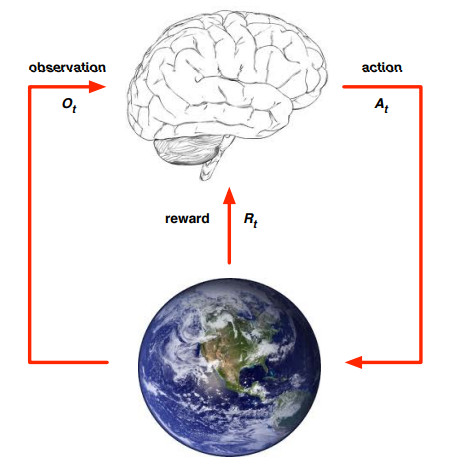

环境受到行动的影响后，又产生$O_{t+1}$和$R_{t+1}$​​，输入到智能体中。

## 状态 - State

### 历史和状态

`历史`就是一连串很长的序列，包括观察、行动和奖励：
$$
H_t=O_1,R_1,A_1,...,A_{t-1},O_t,R_t
$$
也就是所有可观测变量在t时刻及之前的信息，或者是说机器人或嵌入式智能体的感觉运动流。（这个理解起来比较抽象）

下一步的行动取决于历史

- 智能体选择行动
- 环境选择观察和奖励

`状态`是决定下一步发生什么的信息，可以看作一种“总结”信息，相比于`历史`，状态更精练。

正规来说，状态是一个关于历史的函数：
$$
S_t = f(H_t)
$$

### 环境状态 - Environment State

环境状态用$S_t^e$来表示，环境状态即环境所使用的一切用来产生观测和奖励的数据。

通常来说，环境状态对于智能体是不可见的。就算可见，它当中也可能包含了一些不相关的信息。

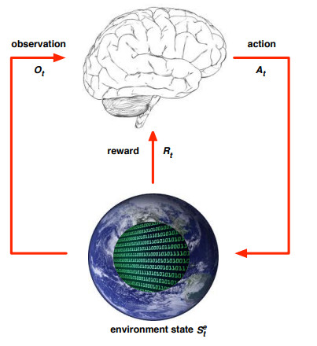

## 智能体状态 - Agent State

用$S_t^a$表示智能体状态，它是智能体的内部表达，即一切智能体用于选择下一步行动所用的任何信息。

智能体状态是强化学习算法所使用的信息。

它可以是任何关于历史的函数：
$$
S_t^a = f(H_t)
$$

### 信息状态 - Information State

信息状态（也即`马尔科夫状态`）包含了历史中所有的有用信息。

> **定义**
>
> 状态$S_t$是**马尔科夫**的当且仅当
> $$
> \mathbb{P}\left[S_{t+1} \mid S_{t}\right]=\mathbb{P}\left[S_{t+1} \mid S_{1}, \ldots, S_{t}\right]
> $$

“给定现在，未来就和过去无关”
$$
H_{1:t}\rightarrow S_t \rightarrow H_{t+1:\infty}
$$
当目前状态已知，就不需在意过去了，即现在的状态是将来的充分统计量。

环境状态$S_t^e$​和历史$H_t$​是马尔科夫的。

*所以$S_t^a$不是马尔科夫的？*

### 例子：老鼠

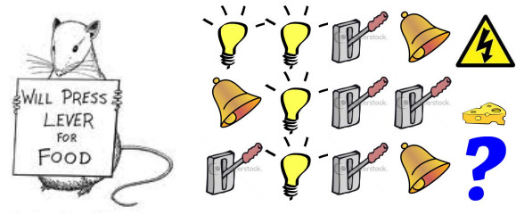

老鼠在第三轮是得到奶酪还是遭到电击？

- 如果智能体状态==最后三项的顺序会怎样？
  - 电击
- 如果智能体状态==光、铃铛、控制杆的数量会怎样？
  - 奶酪
- 如果智能体状态==完全的序列会怎样？
  - 未知

### 全观测环境 - Fully Observable Environments

智能体直接观察环境状态
$$
O_t=S_t^a=S_t^e
$$

- 正规的，这就是一个==马尔科夫决策过程==

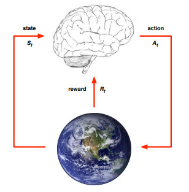

### 部分观测环境 - Partially Observable Environments

部分观测：智能体`间接`地观测环境：

- 机器人在未知环境中通过摄像头视觉观测
- 交易智能体只能观测到当前价格
- 打牌智能体只能看到明面上的牌

现在，智能体状态≠环境状态

这被称为`部分观测马尔可夫决策过程`（POMDP）

智能体必须构建自己的环境表达$S_t^a$，比如：

- 通过完全的历史构造：$S_t^a = H_t$
- 对环境状态的`置信度`：$S_t^a=(\mathbb{P}[S_t^e=s^1],...,\mathbb{P}[S_t^e=s^n])$
- 循环神经网络：$S_t^a = \sigma(S_{t-1}^a W_s+O_t W_o)$
  - 即当前时段的智能体状态=上一时段智能体状态和观测值的线性组合

## 强化学习智能体的主要组成部分

一个强化学习智能体可能包含一个或更多如下组件：

- 策略：智能体的行为函数
- 值函数：评估每个状态/行动的好坏
- 模型：智能体对于环境的表示

### 策略 - Policy

`策略`是智能体的行为，它是一个从状态到行动的映射，比如有：

- 确定策略：$a=\pi(s)$
- 随机策略：$\pi(a|s)=\mathbb{P}[A_t=a|S_t=s]$

### 值函数 - Value Function

`值函数`是对将来奖励的一种预测，用来评估状态的好坏，由此来选择行动，比如：
$$
v_{\pi}(s)=\mathbb{E}_{\pi}\left[R_{t+1}+\gamma R_{t+2}+\gamma^{2} R_{t+3}+\ldots \mid S_{t}=s\right]
$$
$\gamma$是一个0和1之间的数，上式说明给定状态s，越往后的奖励对智能体这一步的价值计算影响越小。所以智能体更看重短期内的奖励

### 模型 - Model

模型不是必须的，模型预测`环境`接下来会如何

$\mathcal{P}$预测了接下来的状态

$\mathcal{R}$预测了紧接着的奖励

比如：
$$
\begin {aligned} \mathcal{P}_{s s^{\prime}}^{a} &=\mathbb{P}\left[S_{t+1}=s^{\prime} \mid S_{t}=s, A_{t}=a\right] \\ \mathcal{R}_{s}^{a} &=\mathbb{E}\left[R_{t+1} \mid S_{t}=s, A_{t}=a\right] \end{aligned}
$$
第一个就是所谓的状态转移方程？

### 例子：迷宫

奖励：每走一步奖励-1

行动：包括：东、南、西、北

状态：智能体的位置

#### 策略

箭头代表每个状态对应的策略$\pi(s)$

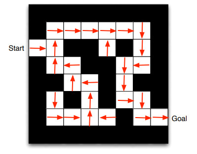

#### 值函数

数字代表每个状态对应的值函数$v_\pi(s)$

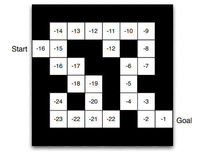

每次选择值函数最大的行动

#### 模型

智能体可能有一个关于环境的内部模型，它可能是不完美的模型

- 动态：行动如何改变环境
- 奖励：每种状态有多少奖励

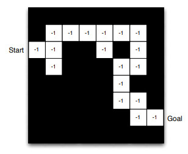

网格表示了状态转移模型$\mathcal{P}_{ss^{\prime}}^a$

数字表示了每个状态的即时奖励$\mathcal{R}_s^a$（对所有a都相同）

### 强化学习智能体的分类 1

- 基于值的
  - ~~没有策略~~（隐含策略）
  - 值函数
- 基于策略的
  - 策略
  - ~~没有值函数~~
- 演员评论家（Actor Critic）
  - 策略
  - 值函数

### 强化学习智能体的分类 2

- 无模型
  - 策略或（和）值函数
  - ~~无模型~~

- 基于模型
  - 策略或（和）值函数
  - 模型

个人感觉这两者的区别有点像机器学习中判别模型和生成模型的区别。生成模型对应基于模型的RL。

### 强化学习智能体的分类 

大多数情况下，值函数都包含了策略

### 学习和规划

在贯序决策中，有两个基本的问题：

- 强化学习

  - **初始环境未知**
  - 智能体与环境交互来学习
  - 智能体会改进其策略

  （可否改进强化学习，告诉其初始环境呢？）

- 规划

  - **一个关于环境的模型是已知的**
  - 智能体通过模型计算来学习（而不是与外部交互）
  - 智能体会改进其策略
  - 也即，深思，推理，反省，思考，思考，寻找

### Atari例子：强化学习

游戏的规则是未知的，智能体通过直接玩游戏来学习，从操纵杆选择行动，观测像素和得分

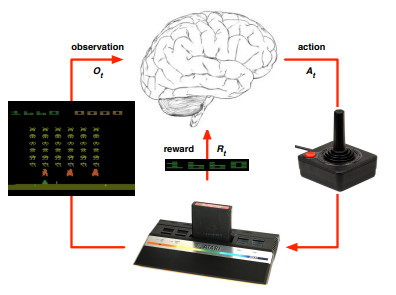

### Atari例子：规划

游戏规则已知，可以查询模拟器，智能体脑中有一个完美模型，如果在状态s下采取了行动a，下一个行动是什么？得分会怎样？...都可以被计算出

提前规划来寻找最优策略，比如：树搜索

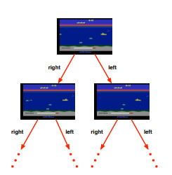

### 开发和探索

强化学习就像`试验-试错`学习，智能体从其经验和环境中应该发现一个良好的策略，但沿途却不会失去太多奖励。

- **探索** *发现* 环境中的更多信息
- **开发** *挖掘* 已知信息来使奖励最大化
- 探索和开发**同样重要**

### 例子

- 餐馆选择
  - `开发`选择最喜爱的餐馆
  - `探索`选择一个新餐馆
- 在线广告牌
  - `开发`展示最成功的广告
  - `探索`展示一个不同的广告
- 石油开采
  - `开发`在最著名的地点开采
  - `探索`在一个新的地点开采
- 玩游戏
  - `开发`采取一个你认为最佳的行动
  - `探索`采取一个实验性的行动

### 预测和控制

- 预测：评估未来
  - 给定一个策略
- 控制：最优化未来
  - 找到最优策略

### 网格世界例子：预测

均匀随机策略的值函数是什么？

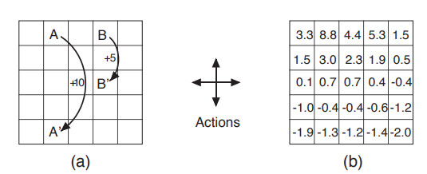

### 网格世界例子：控制

所有可能策略的最优值函数是什么？

最优策略是什么？

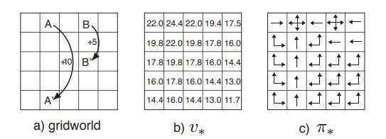

## 课程大纲

- 第一部分：基础的强化学习
  - 基本介绍
  - 马尔科夫决策过程
  - 动态规划
  - 无模型预测
  - 无模型控制
- 第二部分：实际中的强化学习
  - 值函数估计
  - 策略下降方法
  - 学习和规划集成
  - 开发和探索
  - 案例学习 - 游戏中的强化学习

因为是在一下午做完的，后面做得比较粗糙。

